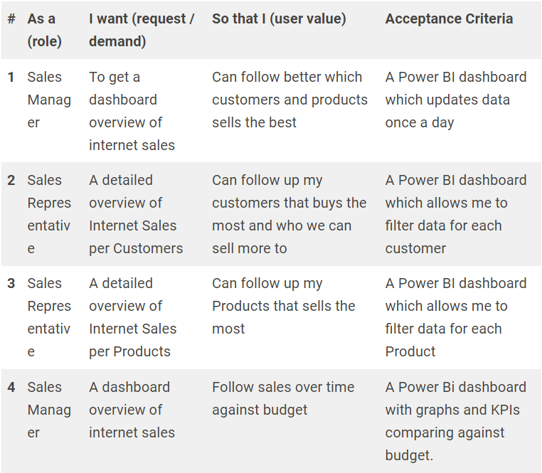
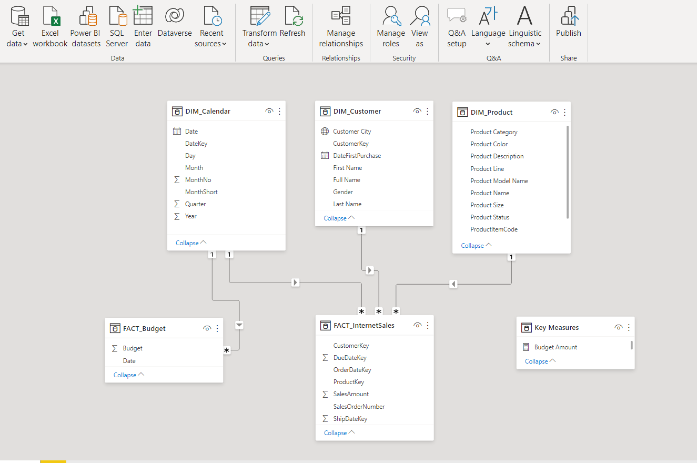
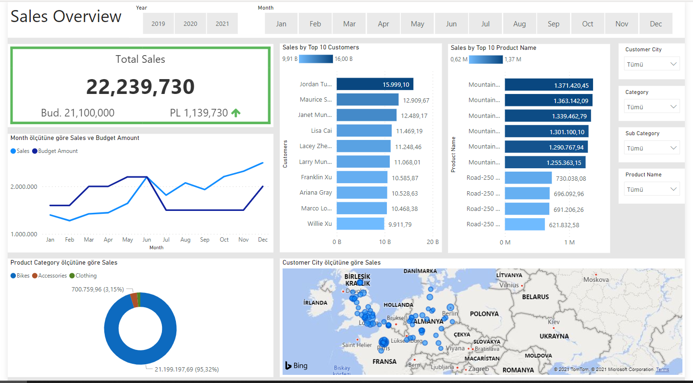

# DataAnalysisPowerBI_SQL

<h2>Business Request & User Stories</h2> 
The business request for this data analyst project was an executive sales report for sales managers. 
Based on the request that was made from the business we following user stories were defined to fulfill delivery and ensure that acceptance criteria’s were maintained throughout the project.  

 
<h2>Data Cleansing & Transformation SQL</h2>
 
To create the necessary data model for doing analysis and fulfilling the business needs defined in the user stories the following tables were extracted using SQL.
One data source (sales budgets) were provided in Excel format and were connected in the data model in a later step of the process.
Below are the SQL statements for cleansing and transforming necessary data.
 
<h2>Data Model</h2>
 
Below is a screenshot of the data model after cleansed and prepared tables were read into Power BI.
This data model also shows how FACT_Budget hsa been connected to FACT_InternetSales and other necessary DIM tables.
 

 
<h2>Sales Overview Dashboard</h2>
 

